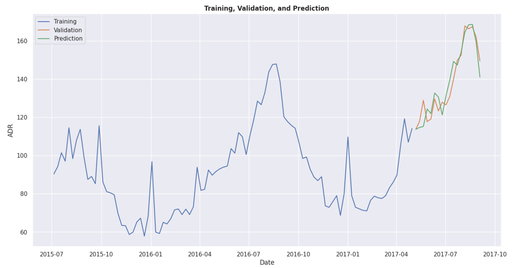

# Hotel Booking Demand Dataset
The purpose of this project is to predict hotel booking cancellations using classification models (logistic regression, random forest, and support vector machine (SVM), and to predict average daily rate (ADR) using an ARIMA model. The dataset used for this project is the hotel booking demand dataset provided by Antonio, Almeida and Nunes (2019). Access here: [Hotel booking demand dataset](https://www.kaggle.com/datasets/jessemostipak/hotel-booking-demand/data)

 

### Predicting ADR with ARIMA Model
ADR is a widely used metric in the hospitality industry that serves as a crucial indicator of a hotel’s financial performance. It represents the average revenue earned per occupied room on a given day [(Hargrave, 2020)](https://www.investopedia.com/terms/a/average-daily-rate.asp). Since ADR provides valuable insights into pricing strategies, demand trends, and revenue management, predicting future ADR can enable the hotels to optimise their room rates to maximise revenue. In this report, ‘auto-arima’ is used in Python to predict future ADR values based on past ADR values.

 

